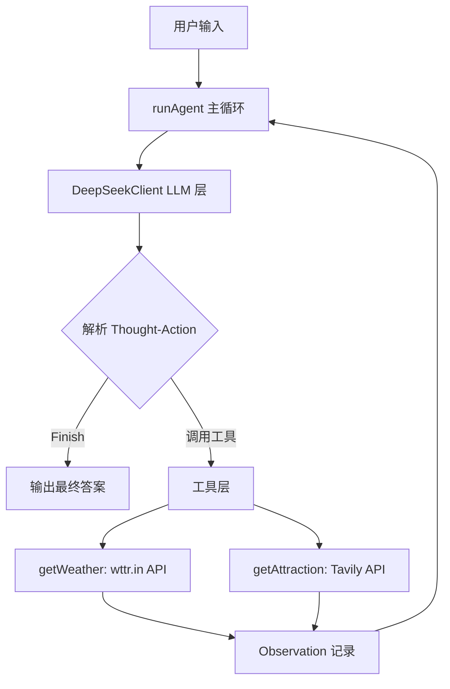

# 智能旅行助手 (Smart Travel Assistant)

基于 TypeScript 构建的智能旅行助手 Agent，核心流程遵循 **Thought-Action-Observation** 范式。接收用户的旅行请求，通过 LLM 分析意图、调用天气查询和景点推荐工具，最终输出完整的旅行建议。

## 功能特性

- **天气查询**：调用 [wttr.in](https://wttr.in/) API 获取指定城市实时天气信息
- **景点推荐**：基于城市和天气，通过 [Tavily](https://tavily.com/) API 搜索并推荐合适的旅游景点
- **LLM 推理**：封装 DeepSeek API 客户端（兼容 OpenAI Chat Completions 格式），负责解析用户意图并决策工具调用
- **主执行循环**：解析 LLM 输出的 Thought-Action 对，动态调用工具获取 Observation，循环迭代直到生成最终答案
- **交互式输入**：支持命令行交互，运行后等待用户输入旅行请求

## 技术选型

| 类别 | 技术 |
|------|------|
| 运行环境 | Node.js + TypeScript |
| HTTP 客户端 | [axios](https://axios-http.com/) |
| 搜索引擎 | [@tavily/core](https://www.npmjs.com/package/@tavily/core) |
| 环境变量 | [dotenv](https://www.npmjs.com/package/dotenv) |
| LLM 服务 | [DeepSeek API](https://platform.deepseek.com/)（兼容 OpenAI 格式） |
| 执行方式 | `ts-node` 直接运行 或 `tsc` 编译后运行 |

## 架构概览



### 关键设计

- **低温度参数**：`temperature: 0.1`，确保 Thought-Action 输出格式稳定
- **正则解析**：使用正则提取 Thought-Action 对，兼容 LLM 输出的微小格式偏差
- **最大迭代保护**：`maxIterations = 5`，防止无限循环
- **错误分层处理**：工具函数内部捕获 API 异常并返回描述性错误信息，作为 Observation 反馈给 LLM 进行自我纠正

## 目录结构

```
smart-travel-assistant/
├── src/
│   └── index.ts          # 主实现文件（工具函数、LLM 客户端、主循环、交互入口）
├── package.json           # 项目配置与依赖声明
├── tsconfig.json          # TypeScript 编译配置
├── .env                   # 环境变量模板（需自行填入 API Key）
├── .gitignore             # Git 忽略规则
└── README.md
```

## 快速开始

### 前置要求

- [Node.js](https://nodejs.org/) >= 18
- [DeepSeek API Key](https://platform.deepseek.com/api_keys)
- [Tavily API Key](https://app.tavily.com/)

### 安装

```bash
# 克隆项目
git clone git@github.com:sanMao147/smart-travel-assistant.git
cd smart-travel-assistant

# 安装依赖
npm install
```

### 配置环境变量

复制 `.env` 文件并填入你的 API 密钥：

```env
DEEPSEEK_API_KEY=你的_deepseek_api_key
DEEPSEEK_BASE_URL=https://api.deepseek.com/v1
TAVILY_API_KEY=你的_tavily_api_key
```

> ⚠️ `.env` 文件包含敏感信息，已通过 `.gitignore` 排除，不会被提交到 Git。

### 运行

```bash
# 方式一：ts-node 直接运行（推荐）
npm run dev

# 方式二：编译后运行
npm run build
npm start
```

运行后在命令行输入旅行请求，例如：

```
请输入你的旅行请求: 查询今天北京的天气，推荐合适的旅游景点
```

## 工作流程

Agent 的执行遵循 **Thought-Action-Observation** 循环：

1. **用户输入** → 接收旅行请求
2. **LLM 推理** → 输出 Thought（思考）+ Action（行动）
3. **Action 解析** → 
   - 若为工具调用：执行 `getWeather` 或 `getAttraction`
   - 若为 `Finish[...]`：输出最终答案并结束
4. **Observation** → 工具返回结果，追加到对话历史
5. **循环迭代** → 回到步骤 2，直到生成最终答案或达到最大迭代次数

### 示例输出

```
用户输入: 查询北京天气并推荐景点
------------------------------------------------

--- 循环 1 ---

模型输出:
Thought: 需要先查询北京的天气情况
Action: 调用工具: get_weather(city="北京")

Observation: 北京当前天气:晴朗，气温25摄氏度
------------------------------------------------

--- 循环 2 ---

模型输出:
Thought: 已获取天气，现在根据天气推荐景点
Action: 调用工具: get_attraction(city="北京", weather="晴朗，气温25摄氏度")

Observation: 根据当前晴朗天气，推荐故宫、颐和园...
------------------------------------------------

任务完成，最终答案: 北京今天天气晴朗，气温25°C，适合户外活动。推荐景点：故宫、颐和园...
```
